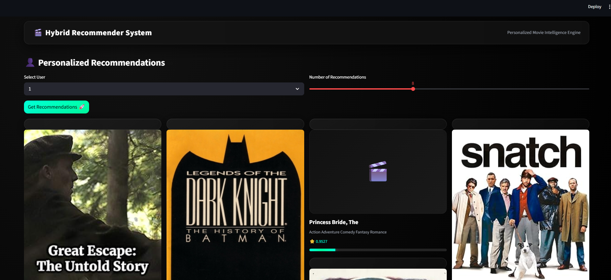
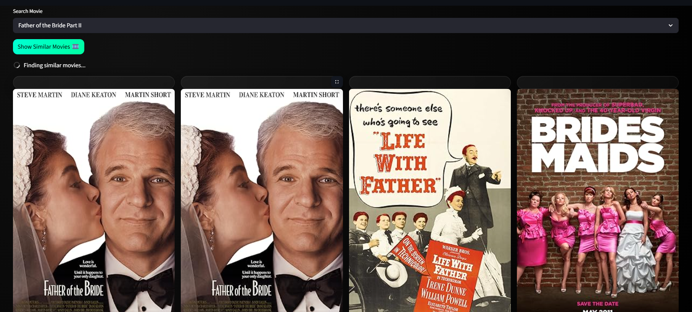

🎬 Hybrid Movie Recommender System
Production-Ready AI Recommendation Platform

An end-to-end hybrid recommendation system combining Collaborative Filtering and Transformer-based Content Embeddings to deliver personalized movie recommendations.

The system includes:

🧠 Machine Learning recommendation engine

⚙️ Production-ready FastAPI backend

🎨 Interactive Streamlit UI

❄️ Cold-start handling for new users and items

🚀 Cloud deployment

🚀 Live Demo

🌐 Backend API (Render)
https://hybrid-recommender-api-2yxt.onrender.com

🎨 Interactive Web App (Streamlit)
https://hybrid-appuct-recommender-sarveshch.streamlit.app/

📘 API Documentation
https://hybrid-recommender-api-2yxt.onrender.com/docs

📸 Application Screenshots
🎬 Personalized Movie Recommendations

  

🔍 Similar Movie Discovery

  

🧠 Problem Statement

Modern platforms like Netflix, Amazon, and Spotify rely on recommendation systems to improve user engagement.

However, traditional recommendation systems face several problems:

Cold-start problem for new users

Cold-start problem for new items

Poor personalization

Lack of semantic understanding of content

This project solves these issues using a Hybrid Recommendation Architecture.

🧠 How the System Works

1️⃣ User selects a profile in the web interface

2️⃣ Backend loads the trained hybrid recommendation model

3️⃣ Two recommendation signals are generated:

Collaborative Filtering

Learns patterns from user-item interaction data.

Uses:

Matrix factorization

SVD algorithm

Content-Based Embeddings

Movie metadata is converted into semantic embeddings using Sentence Transformers.

This helps understand:

genres

plot descriptions

semantic similarity

Hybrid Scoring

Both signals are combined using a weighted scoring function.

Final recommendation score:

Final Score = α * Collaborative Score + (1 − α) * Content Score

Movies are ranked and the Top-N recommendations are returned.

🏗️ System Architecture
User Interaction
        │
        ▼
Streamlit Web App
        │
        ▼
FastAPI Backend
        │
        ▼
Hybrid Recommendation Engine
        │
 ┌───────────────┬─────────────────┬──────────────┐
 │               │                 │              │
 ▼               ▼                 ▼              ▼
Collaborative   Content           Cold Start     Evaluation
Filtering       Embeddings        Handler        Metrics
(SVD)           (Transformers)
        │
        ▼
Hybrid Scoring Engine
        │
        ▼
Top-N Ranked Recommendations
✨ Key Features
🧠 Machine Learning

✔ Hybrid recommendation system
✔ Transformer-based semantic embeddings
✔ Matrix factorization (SVD)
✔ User profile vector generation
✔ Precision@K evaluation
✔ Hyperparameter tuning

❄️ Cold Start Handling

Handles real-world recommendation challenges.

New Users

Uses popularity-based recommendations

New Movies

Uses embedding similarity search

⚙️ Engineering Features

✔ Modular architecture
✔ Component-based ML design
✔ End-to-end training pipeline
✔ Config-driven setup
✔ Custom logging system
✔ Exception handling
✔ Serialized model artifacts

🌐 Backend (FastAPI)

Production-ready REST API for recommendation inference.

API Endpoints
Endpoint	Description
/recommend	Personalized recommendations
/similar/{movie_id}	Find similar movies
/movies	Movie metadata
/docs	Swagger API documentation
🎨 Frontend (Streamlit)

Interactive web interface inspired by streaming platforms.

Features include:

✔ Netflix-style UI
✔ Poster grid layout
✔ Recommendation slider
✔ Movie search bar
✔ Similar movie discovery
✔ Hover animations
✔ OMDb API for posters
✔ Responsive layout

🛠️ Tech Stack
Machine Learning

Python

Pandas

NumPy

Scikit-learn

Surprise (Collaborative Filtering)

Sentence Transformers

Cosine Similarity

Backend

FastAPI

Uvicorn

Pydantic

Frontend

Streamlit

Custom CSS

OMDb API

Deployment

Render → FastAPI backend

Streamlit Cloud → Web interface

GitHub → Source code hosting

📂 Project Structure
hybrid-product-recommender
│
├── docs
│   └── screenshots
│       ├── recommendations.png
│       └── similar_movies.png
│
├── src
│   │
│   ├── components
│   │   ├── collaborative.py
│   │   ├── embeddings.py
│   │   ├── hybrid.py
│   │   ├── cold_start.py
│   │   ├── preprocessing.py
│   │   ├── user_profiles.py
│   │   └── evaluation.py
│   │
│   ├── pipeline
│   │   └── training_pipeline.py
│   │
│   ├── api
│   │   ├── main.py
│   │   └── schemas.py
│   │
│   └── ui
│       └── streamlit_app.py
│
├── models
├── data
├── logs
│
├── image.png
├── requirements.txt
└── README.md
⚙️ Setup & Run Locally
1️⃣ Clone the Repository
git clone https://github.com/SarveshChhabra77/hybrid-product-recommender.git
cd hybrid-product-recommender
2️⃣ Create Virtual Environment
python -m venv venv

Activate environment

Windows

venv\Scripts\activate

Mac / Linux

source venv/bin/activate
3️⃣ Install Dependencies
pip install -r requirements.txt
🧪 Run Backend API
uvicorn src.api.main:app --reload

Open documentation:

http://127.0.0.1:8000/docs
🎨 Run Streamlit UI
streamlit run src/ui/streamlit_app.py
🧪 Example API Request

POST /recommend

{
  "user_id": 10,
  "top_n": 5
}
📊 Model Evaluation
Metric	Score
Precision@K	0.0705
Best Alpha	0.7

Optimized using grid-search hyperparameter tuning.

📦 Deployment Strategy
Training Environment

Uses full dataset

Trains recommendation models

Generates serialized artifacts

Production Environment

Loads trained model artifacts

No raw dataset required

Lightweight inference pipeline

Scalable API architecture

💼 Resume Highlights

This project demonstrates:

✔ Hybrid recommender system architecture
✔ Transformer-based semantic embeddings
✔ Machine learning pipeline design
✔ Backend API development with FastAPI
✔ Interactive UI with Streamlit
✔ End-to-end ML system deployment

🔮 Future Improvements

User authentication

Watch history tracking

Feedback-based ranking

Vector database integration

Real-time recommendation updates

Microservice-based architecture

👨‍💻 Author

Sarvesh Chhabra

Machine Learning Engineer | Data Engineer

GitHub
https://github.com/SarveshChhabra77

⭐ Support

If you like this project:

⭐ Star the repository
🍴 Fork the project
📢 Share it with others