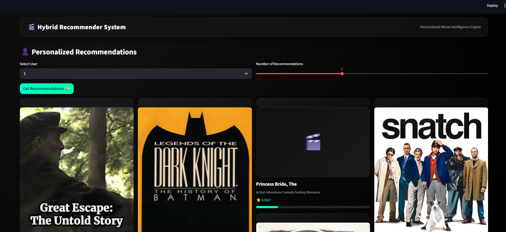
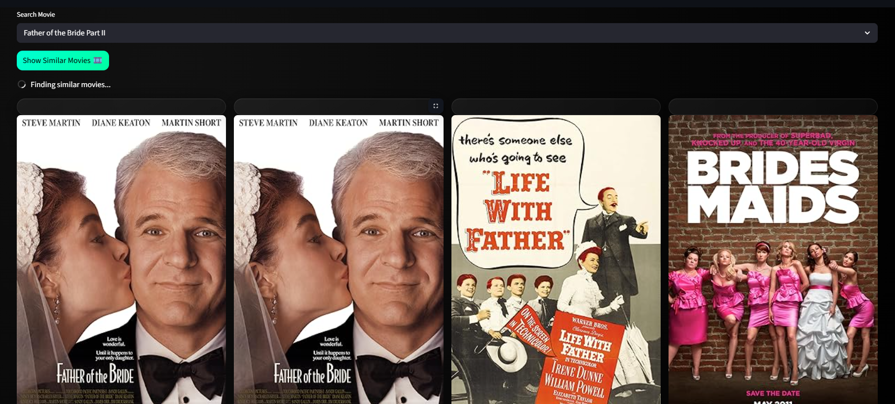

# 🎬 Hybrid Movie Recommender System
### Production-Ready AI Recommendation Platform




An **end-to-end hybrid recommendation system** combining **Collaborative Filtering** and **Transformer-based Content Embeddings** to deliver personalized movie recommendations.

The system includes:

- 🧠 Machine Learning recommendation engine
- ⚙️ Production-ready FastAPI backend
- 🎨 Interactive Streamlit UI
- ❄️ Cold-start handling for new users and items
- 🚀 Cloud deployment

---

# 🚀 Live Demo

🌐 **Backend API (Render)**  
https://hybrid-recommender-api-2yxt.onrender.com

🎨 **Interactive Web App (Streamlit)**  
https://hybrid-appuct-recommender-sarveshch.streamlit.app/

📘 **API Documentation**  
https://hybrid-recommender-api-2yxt.onrender.com/docs

---

# 📸 Application Screenshots

## 🎬 Personalized Movie Recommendations

<p align="center">

</p>

---

## 🔍 Similar Movie Discovery

<p align="center">

</p>

---

# 🧠 Problem Statement

Modern platforms like **Netflix, Amazon, and Spotify** rely on recommendation systems to improve user engagement.

However traditional recommender systems struggle with:

- Cold-start problem for new users
- Cold-start problem for new items
- Poor personalization
- Lack of semantic understanding of content

This project solves these problems using a **Hybrid Recommendation Architecture**.

---

# 🧠 How the System Works

1️⃣ User selects a profile in the web interface

2️⃣ Backend loads the **trained hybrid recommendation model**

3️⃣ Two recommendation signals are generated

### Collaborative Filtering

Learns patterns from **user-item interactions** using:

- Matrix factorization
- SVD algorithm

### Content-Based Embeddings

Movie metadata is converted into **semantic embeddings** using **Sentence Transformers**.

This allows the system to understand:

- genres
- plot descriptions
- semantic similarity

### Hybrid Scoring

Both signals are combined using a **weighted scoring function**.

```
Final Score = α * Collaborative Score + (1 − α) * Content Score
```

Top-N movies are returned to the user.

---

# 🏗️ System Architecture

```
User Interaction
        │
        ▼
Streamlit Web App
        │
        ▼
FastAPI Backend
        │
        ▼
Hybrid Recommendation Engine
        │
 ┌───────────────┬─────────────────┬──────────────┐
 │               │                 │              │
 ▼               ▼                 ▼              ▼
Collaborative   Content           Cold Start     Evaluation
Filtering       Embeddings        Handler        Metrics
(SVD)           (Transformers)

        │
        ▼
Hybrid Scoring Engine
        │
        ▼
Top-N Ranked Recommendations
```

---

# ✨ Key Features

## 🧠 Machine Learning

✔ Hybrid recommendation system  
✔ Transformer-based semantic embeddings  
✔ Matrix factorization (SVD)  
✔ User profile vector generation  
✔ Precision@K evaluation  
✔ Hyperparameter tuning  

---

## ❄️ Cold Start Handling

Handles real-world recommendation challenges.

### New Users
Uses **popularity-based recommendations**

### New Movies
Uses **embedding similarity search**

---

## ⚙️ Engineering Features

✔ Modular architecture  
✔ Component-based ML design  
✔ End-to-end training pipeline  
✔ Config-driven setup  
✔ Custom logging system  
✔ Exception handling  
✔ Serialized model artifacts  

---

# 🌐 Backend (FastAPI)

Production-ready REST API for recommendation inference.

### API Endpoints

| Endpoint | Description |
|--------|-------------|
| `/recommend` | Personalized recommendations |
| `/similar/{movie_id}` | Similar movie search |
| `/movies` | Movie metadata |
| `/docs` | Swagger API documentation |

---

# 🎨 Frontend (Streamlit)

Interactive web interface inspired by streaming platforms.

Features include:

✔ Netflix-style UI  
✔ Poster grid layout  
✔ Recommendation slider  
✔ Movie search bar  
✔ Similar movie discovery  
✔ Hover animations  
✔ OMDb API poster integration  
✔ Responsive layout  

---

# 🛠️ Tech Stack

## Machine Learning

- Python
- Pandas
- NumPy
- Scikit-learn
- Surprise
- Sentence Transformers
- Cosine Similarity

---

## Backend

- FastAPI
- Uvicorn
- Pydantic

---

## Frontend

- Streamlit
- Custom CSS
- OMDb API

---

## Deployment

- Render → FastAPI backend
- Streamlit Cloud → Web interface
- GitHub → Source code hosting

---

# 📂 Project Structure

```
hybrid-product-recommender
│
├── .github
│   └── workflows
│       └── keep_alive.yml          - GitHub Action to ping Render backend periodically
│
├── data
│   ├── movies.csv                  - MovieLens dataset containing movie IDs, titles, and genres
│   ├── ratings.csv                 - MovieLens dataset containing user ratings
│   └── README.md                   - Dataset details and attribution documentation
│
├── docs
│   └── screenshots
│       ├── recommendations.png     - Screenshot of personalized recommendations UI
│       └── similar_movies.png      - Screenshot of similar movie discovery feature
│
├── models
│   ├── cf_model.pkl                - Trained SVD collaborative filtering model artifact
│   ├── item_embeddings.pkl         - Transformer semantic embeddings for all movies
│   ├── user_embeddings.pkl         - Aggregated user preference embedding vectors
│   ├── movie_meta.pkl              - Processed movie metadata mapping dictionary
│   ├── movie_ids.pkl               - Array of valid movie identifiers
│   ├── popular_movies.pkl          - Fallback list of top-rated movies for cold start
│   └── README.md                   - Information on model artifact storage
│
├── notebooks
│   └── experimentation.ipynb      - EDA, feature engineering, and model training playground
│
├── src
│   ├── api
│   │   ├── main.py                 - FastAPI application and endpoint definitions
│   │   └── schemas.py              - Pydantic data schemas for API requests and responses
│   │
│   ├── components
│   │   ├── data_loader.py          - Functions for loading raw MovieLens CSV data
│   │   ├── preprocessing.py        - Data cleaning, filtering, and transformation logic
│   │   ├── embeddings.py           - SentenceTransformer embedding generation module
│   │   ├── collaborative.py        - SVD model wrapper for collaborative filtering
│   │   ├── hybrid.py               - Recommendation engine combining CF & Content scores
│   │   ├── cold_start.py           - Popularity and similarity fallback logic
│   │   ├── user_profiles.py        - Construction of weighted user profile vectors
│   │   └── evaluation.py           - Metrics calculation (Precision@K, hyperparameter tuning)
│   │
│   ├── constants
│   │   └── config.py               - Central configuration for paths, alpha weight, and hyperparameters
│   │
│   ├── exceptions
│   │   └── custom_exception.py     - Custom exception class for detailed error tracing
│   │
│   ├── logging
│   │   └── logger.py               - Centralized logging setup writing to log files
│   │
│   └── pipeline
│       └── training_pipeline.py    - Pipeline script to run end-to-end model training
│
├── ui
│   └── streamlit_app.py            - Streamlit dashboard interface for recommendations
│
├── logs                            - Generated application runtime log files
│
├── app.py                          - Streamlit Cloud deployment entry point proxy
├── setup.py                        - Package setup script for editable installation
├── requirements.txt                - Dependency list for Streamlit Cloud deployment (UI dependencies)
├── requirements-backend.txt        - Complete dependency list for training & FastAPI backend
├── image.png                       - Dashboard preview header image
├── image (2).png                   - Supplementary documentation image
├── .gitignore                      - Specified files and folders ignored by Git
└── README.md                       - Main project documentation
```

---

# ⚙️ Setup & Run Locally

## Clone Repository

```
git clone https://github.com/SarveshChhabra77/hybrid-product-recommender.git
cd hybrid-product-recommender
```

---

## Create Virtual Environment

```
python -m venv venv
```

Activate environment

Windows

```
venv\Scripts\activate
```

Mac / Linux

```
source venv/bin/activate
```

---

## Install Dependencies

```
pip install -r requirements-backend.txt
```

---

# 🧪 Run Backend API

```
uvicorn src.api.main:app --reload
```

Open documentation

```
http://127.0.0.1:8000/docs
```

---

# 🎨 Run Streamlit UI

```
streamlit run ui/streamlit_app.py
```

---

# 🧪 Example API Request

POST `/recommend`

```
{
  "user_id": 10,
  "top_n": 5
}
```

---

# 📊 Model Evaluation

| Metric | Score |
|------|------|
| Precision@K | 0.0705 |
| Best Alpha | 0.7 |

Optimized using **grid-search hyperparameter tuning**.

---

# 📦 Deployment Strategy

## Training Environment

- Uses full dataset
- Trains recommendation models
- Generates serialized artifacts

## Production Environment

- Loads trained model artifacts
- No raw dataset required
- Lightweight inference pipeline
- Scalable API architecture

---

# 💼 Resume Highlights

✔ Hybrid recommender system architecture  
✔ Transformer-based semantic embeddings  
✔ Machine learning pipeline design  
✔ Backend API development with FastAPI  
✔ Interactive UI with Streamlit  
✔ End-to-end ML system deployment  

---

# 🔮 Future Improvements

- User authentication
- Watch history tracking
- Feedback-based ranking
- Vector database integration
- Real-time recommendation updates
- Microservice architecture

---

# 👨‍💻 Author

**Sarvesh Chhabra**

Machine Learning Engineer | Data Engineer

GitHub  
https://github.com/SarveshChhabra77

---

# ⭐ Support

If you like this project:

⭐ Star the repository  
🍴 Fork the project  
📢 Share it with others
